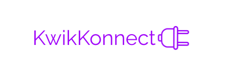

# KwikKonnect
[TOHacks 2020] A Slackbot and web platform that matches people for spontaneous 2-minute video calls.

## Inspiration
With COVID-19 impacting many social and organizational aspects of everyday life, we wanted to develop something that would mitigate the loneliness of social isolation and allow users to stay engaged within their teams and friend groups. Thus, we designed KwikKonnect, a Slack bot and video chat platform which facilitates spontaneous video calls within groups, in the hopes of helping people make new friends and stay close with the ones they already have.

## What it does
**The Bot**

KwikKonnect is a Slack bot and video chat web application which connects users via video calls. Once added to a Slack team, the team organizer configures the duration and frequency of the video calls, with defaults of 10 minutes and 24 hours respectively. The bot then targets random pairs of team members and sends them unique, randomly-generated links which redirect the users to a short, closed video call. After a certain number of matchmaking rounds, the bot targets pairs of team members with low chat traffic in the hopes of increasing interactions and bringing them closer together. If chat interactions between all possible pairs of group members within the team are roughly equal, the bot will revert to pairing random team members.

**The Video Call**

The peer-to-peer connected video calls are hosted on [KwikKonnect.online/](kwikknonnect.online) with a simple, aesthetically-pleasing user interface and last as long as the configured duration. Features include randomly-generated conversation prompts and an option to extend the duration of the call. For the purposes of facilitating conversation, closing the tab or ending the call before the duration is complete is disabled.

## How we built it
We used Express.js and Node.js in Javascript to build both the bot and the video chat platform as well as the Slack-Node SDK for the bot. The Express server was deployed to Google Cloud and is hosted through Domain.com.

## Challenges we ran into
We found it hard to decide on an idea at first, as we wanted to develop something related to social good and improving the current situation, but we didn't know which tools we should try to use. After we decided on the final idea, we realized that none of us had any experience in programming a Slack bot, so it was a challenge working through it all the way from development to deployment.

## What's next for KwikKonnect
In the future, we hope to expand KwikKonnect to other popular platforms such as Discord to further facilitate conversations between others and bring the world closer together from the safety of their own homes.
